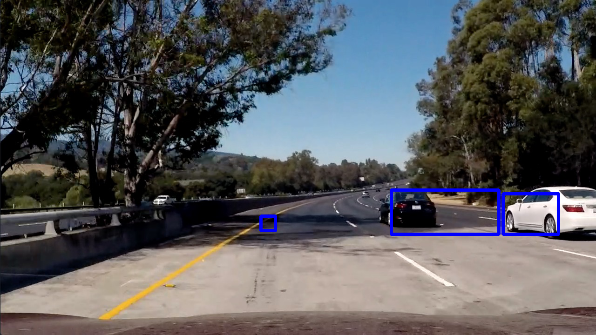
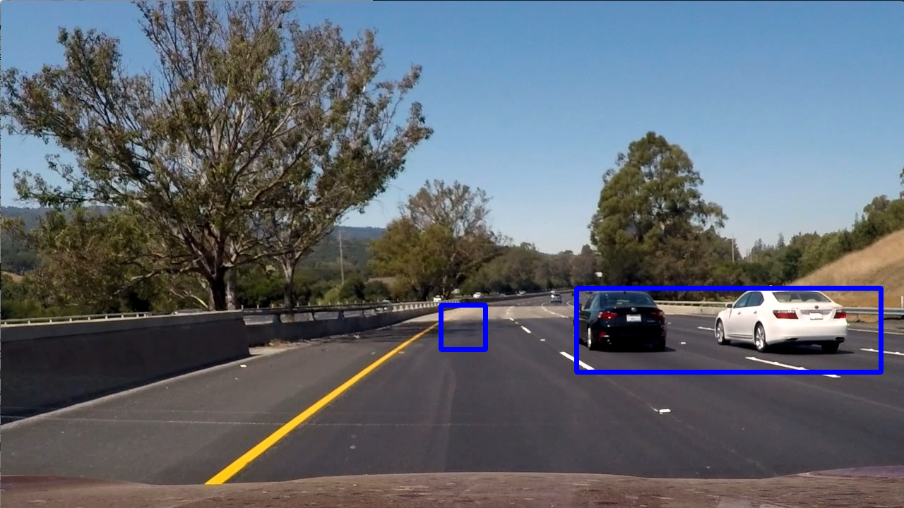
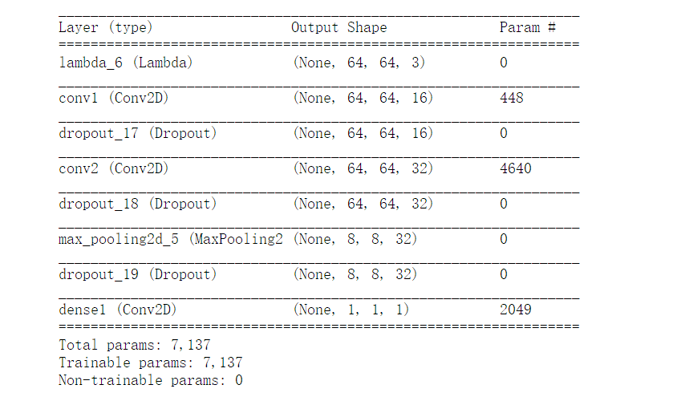
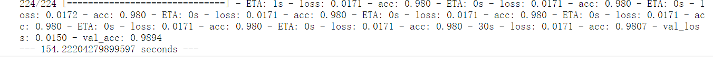
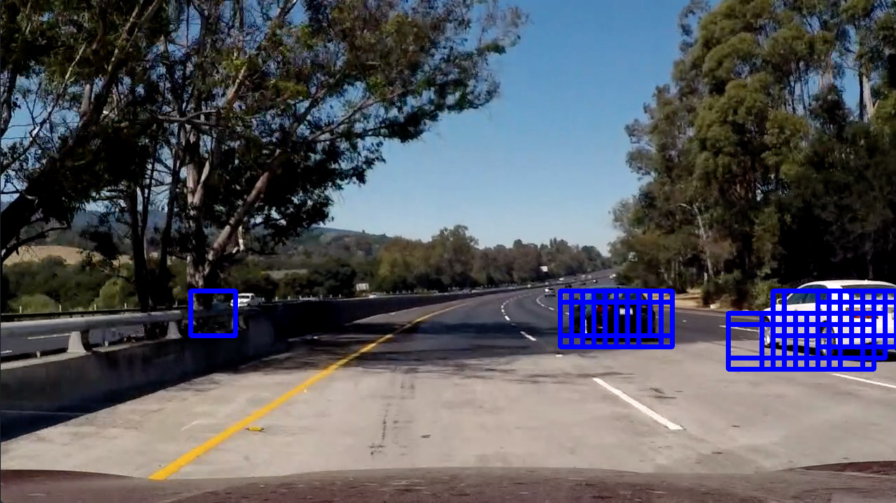
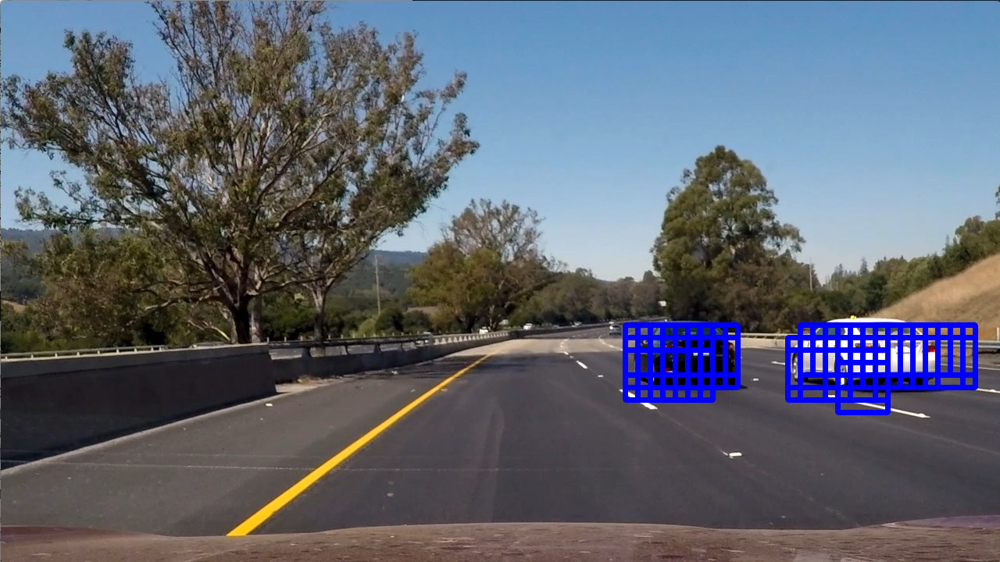
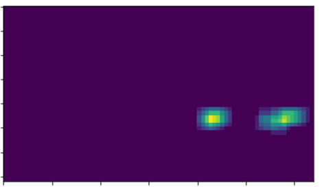
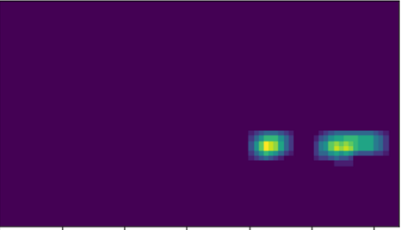

**Vehicle Detection Project**

[code link](CarND-Vehicle-Detection.ipynb)

In this project ,I use 2 method .At last I choose to combine them .

The goals / steps of this project are the following:

1 use cnn to get the feature of image

2  train model with datasets

3 get window lists which start_y between 400 and 660.

4 evaluate the image with model and choose the widow of the accuracy which above 0.5

5 draw rectangle

6 add heat ,apply thresold ,get labels

7 draw bouding box.

## [Explore](https://review.udacity.com/#!/rubrics/513/view) Points
First I use svm to practice my model. the code is in svm_pipline.py,I got 97% accuracy,

but I can't deal with those false positive

you can found in test out_put image

and when i practice in test video ,it becomes even worse.
It use about 30 minute  to process the video,I can't stand it

Expore cnn method
-----------------
I wonder why do not try cnn. at first i want to use faster-cnn, but it's not easy to understant rpn network.

At last inspire by the https://github.com/maxritter/SDC-Vehicle-Lane-Detection. I decided to design my network.

maxritter's network maybe looks well,but it use too many params,it runs out of memory of my GPU.

I reduce the some layer to practice more efficiently.

there are only 7137 params in my model !and i use only 255s to practice my model.and the test accuracy is about 99%
it seems good

slide and search windows
-------------------------
just like the teach video I search the window of image which starty above 400 and endy below 600.

because the car will only exists in this area.

and use the model to predict whether the images  is car or not car. if the probability above 0.5 then car,otherwise not car.

compare svm out_put it seems right.

apply heat and thresold
-----------------------
here is the result of test5 and test6 heatmap

### Video Implementation
==========================

1. test video result

Here's a [link to test result](video_out/test_video.mp4)

2 project video result

Here's a [link to my video result](video_out/project_video.mp4)

Discussion
==========
1 the handle time is still too long
2 slide and search window is  not the most efficient method,i think we can use some algorithm
to find out the area of car
3 the bound in video is not steady and smooth
4 there are some rectangles are not cover all the car.

